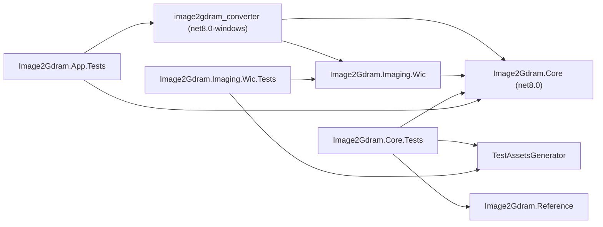
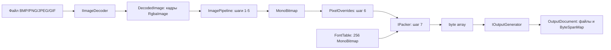
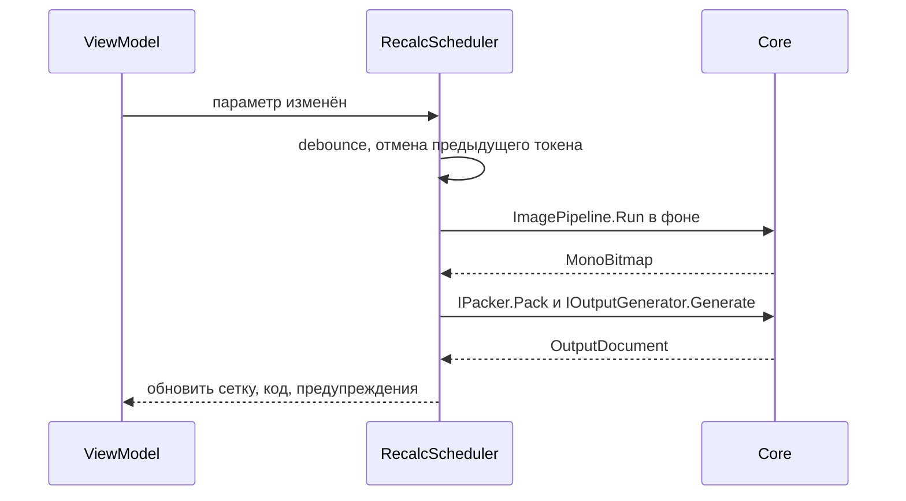

# Архитектура «Image2GDRAM Converter» 1.0

> **Целевая архитектура плюс отметки о фактическом состоянии.** Документ составлен на этапе 0 по разделам 4 и 5 `agents.md` и п. 4.6 ТЗ. После этапа 2 **фактически существуют** решение, модуль упаковки, загрузка изображений и конвейер обработки. Описание упаковки помечено «**Фактически (этап 1)**», загрузки и обработки — «**Фактически (этап 2)**». Остальные разделы — целевые: сигнатуры в них ориентировочные. Сводка — таблица в разделе 10.

Связанные файлы: [`implementation-plan.md`](implementation-plan.md) (этапы), [`decisions.md`](decisions.md) (решения D/F/N/K), [`requirements_checklist.md`](requirements_checklist.md) (трассировка требований).

---

## 1. Структура решения

```
image2gdram_converter.sln
Directory.Build.props
specification.md, agents.md, README.md
build.ps1, publish.ps1
src/
  image2gdram_converter/        WPF-приложение
  Image2Gdram.Core/             ядро без WPF
  Image2Gdram.Imaging.Wic/      декодер WIC (net8.0-windows)
tests/
  Image2Gdram.Reference/        независимая наивная упаковка (эталон)
  Image2Gdram.Core.Tests/       xUnit: ядро
  Image2Gdram.Imaging.Wic.Tests/ xUnit: декодер WIC
  Image2Gdram.App.Tests/        xUnit: сценарии ViewModel
tools/
  TestAssetsGenerator/          тестовые изображения, листы шрифтов, эталонные массивы
  compile-check.ps1             дымовая компиляция сгенерированного C (если есть gcc/clang)
testdata/                       тестовые изображения и testdata/reference/ (эталоны)
docs/                           документация и файлы состояния
```

| Проект | Путь | Платформа | Тип | Ссылки | Пакеты |
|---|---|---|---|---|---|
| `image2gdram_converter` | `src/image2gdram_converter/` | `net8.0-windows` | WinExe (WPF) | `Image2Gdram.Core`, `Image2Gdram.Imaging.Wic` | `CommunityToolkit.Mvvm` 8.4.2, AvalonEdit (MIT) — этап 6 |
| `Image2Gdram.Core` | `src/Image2Gdram.Core/` | `net8.0` | библиотека | — | — |
| `Image2Gdram.Imaging.Wic` | `src/Image2Gdram.Imaging.Wic/` | `net8.0-windows` | библиотека | Core | — (WIC из WPF, N-39, N-41) |
| `Image2Gdram.Reference` | `tests/Image2Gdram.Reference/` | `net8.0` | библиотека | — (Core не используется, N-28) | — |
| `Image2Gdram.Core.Tests` | `tests/Image2Gdram.Core.Tests/` | `net8.0` | xUnit | Core, Reference, `TestAssetsGenerator` | xUnit, `Microsoft.NET.Test.Sdk` |
| `Image2Gdram.Imaging.Wic.Tests` | `tests/Image2Gdram.Imaging.Wic.Tests/` | `net8.0-windows` | xUnit | Core, Imaging.Wic, `TestAssetsGenerator` | xUnit, `Microsoft.NET.Test.Sdk` |
| `Image2Gdram.App.Tests` | `tests/Image2Gdram.App.Tests/` | `net8.0-windows` | xUnit | приложение, Core | xUnit, `Microsoft.NET.Test.Sdk` |
| `TestAssetsGenerator` | `tools/TestAssetsGenerator/` | `net8.0` | консоль | — (Reference — этап 9, когда появятся эталонные массивы) | — (PNG — собственный кодировщик, N-39) |

Проекты `Image2Gdram.Reference` и `Image2Gdram.App.Tests` дополняют структуру раздела 4 `agents.md` (решение N-32). ImageSharp не используется (N-39). `WicImageDecoder` — отдельная сборка `Image2Gdram.Imaging.Wic` (N-41); интерфейс `IImageDecoder` — в Core. Тесты декодера — `Image2Gdram.Imaging.Wic.Tests`, не `App.Tests`. Версии тестовых пакетов — N-38 (MIT и Apache-2.0).



### Правила зависимостей

- Core не ссылается на WPF и не содержит строк интерфейса: предупреждения и ошибки Core возвращает кодами с параметрами (`Diagnostic`), текст для пользователя берётся из словаря приложения. Тексты внутри генерируемых файлов (заголовок-комментарий на русском) — часть формата вывода и живут в Core.
- ImageSharp нет (N-39, K-05). WIC (`System.Windows.Media.Imaging`) только в `WicImageDecoder` в проекте `net8.0-windows`. Core остаётся `net8.0` без WPF. `TestAssetsGenerator` пишет PNG собственным кодировщиком, без NuGet. Поворот, масштабирование, серое и дизеринг — собственный код над `RgbaImage`.
- `Image2Gdram.Reference` не ссылается на Core и не делит с ним исходники.
- Приложение: MVVM на CommunityToolkit.Mvvm; в code-behind только визуальная логика (мышь в сетке, прокрутка).
- Общие свойства сборки — `Directory.Build.props`: `Nullable=enable`, `ImplicitUsings=enable`, `TreatWarningsAsErrors=true`, `Deterministic=true`; версия 1.0.0, Product «Image2GDRAM Converter».

---

## 2. Конвейер модулей (п. 4.6 ТЗ)



Каждый модуль общается с соседями только через типы на стрелках. Новый режим упаковки или формат вывода добавляется новым классом и регистрацией в реестре без правки остальных модулей (раздел 7).

---

## 3. Ядро: пространства имён и ключевые типы

Сигнатуры ориентировочные; окончательные уточняются при реализации и вносятся сюда.

### 3.1. `Image2Gdram.Core.Imaging` — загрузка (этап 2)

**Фактически (этап 2).** Сигнатуры ниже совпадают с кодом. Отличия от черновика этапа 0: код `ImageLoadError.MemoryLimit` (суммарный объём кадров больше 512 МБ, N-41); размер читается своим разбором заголовка, затем WIC копирует пиксели.

- `RgbaImage` — `Width`, `Height`, `Pixels` (прямой RGBA, 8 бит на канал, строки сверху вниз). Пиксели можно задать через `SetPixel`; после передачи в `ImagePipeline` буфер не меняют: конвейер кэширует кадр по ссылке.
- `ImageInfo` — формат, ширина и высота в файле (до EXIF), число кадров.
- `DecodedImage` — `IReadOnlyList<RgbaImage> Frames` одного размера, формат, признак анимации. Размер кадра — уже после EXIF.
- `IImageDecoder` — `ImageInfo Identify(string path)`, `DecodedImage Decode(string path, CancellationToken cancellationToken = default)`.
- `ImageLoadException` — `ImageLoadError` (`TooLarge`, `MemoryLimit`, `Unsupported`, `Corrupted`, `IoError`), путь и необязательные ширина и высота. Текст исключения — причина для пользователя.
- `ImageLimits` — сторона 8192 включительно, суммарно не больше 512 МБ RGBA.
- `WicImageDecoder : IImageDecoder` — проект `Image2Gdram.Imaging.Wic` (N-39, N-41). Цветовой профиль не применяется (`IgnoreColorProfile`). Ориентация EXIF — `RotateFlipStep` (N-19, N-41). Кадры GIF собирает собственный код: холст изначально прозрачный, disposal 2 и 3 — N-41; лимит 512 МБ проверяется до выделения холста (N-20). Файл открывается только на чтение и после возврата не занят.

### 3.2. `Image2Gdram.Core.Processing` — обработка, шаги 1–6 п. 4.1.2 (этап 2)

**Фактически (этап 2).** Классы шагов совпадают с черновиком. Дополнительно: `Binarizer.Create`, `FramePixelOverrides`, `ImagePipeline.Pack` и `RunAndPack` (шаг 7 через `PackerRegistry`), `PipelineException` с кодом `SourceLargerThan1024` (D-07).

- `ProcessingOptions` (sealed record, `Default`) — фон, поворот, отражения, ручной размер или «по исходному», режим вписывания, выравнивание, смещение, алгоритм масштабирования, режим бинаризации, порог. Значения по умолчанию — N-41.
- Шаги, каждый — отдельный класс с явными параметрами:
  - `BackgroundCompositor` — F-06;
  - `RotateFlipStep` — F-07, N-10; им же пользуется декодер для EXIF;
  - `ResizeStep` (`FitMode`: `None`/`Fit`/`Stretch`/`Fill`; `Alignment`: 9 позиций; `ResampleMode`: `AreaAverage`/`NearestNeighbor`) — F-08, D-06;
  - `GrayscaleStep` → `GrayImage` — F-09;
  - `IBinarizer` → `MonoBitmap`: `ThresholdBinarizer`, `FloydSteinbergDitherer`, `AtkinsonDitherer`, `BayerDitherer(4|8)` — F-09, F-10. Выбор — `Binarizer.Create`.
- `ImagePipeline` — `MonoBitmap Run(RgbaImage source, ProcessingOptions options, PixelOverrides? overrides, CancellationToken cancellationToken)`. Кэш промежуточных кадров принадлежит экземпляру и не потокобезопасен: смена порога или режима бинаризации не повторяет масштабирование. `RunAndPack` добавляет шаг 7.
- `PixelOverrides` — разреженный словарь `(x, y) → active`; `Apply` пропускает координаты вне растра; `Entries` идёт по возрастанию y, затем x. `FramePixelOverrides` хранит отдельный набор на кадр GIF (F-11).

### 3.2.1. `Image2Gdram.Core.Editing` — история правок (этап 2, частично)

**Фактически (этап 2).** `IEditAction`, `EditHistory` (глубина 200, N-14), `PixelStrokeAction` (один штрих — одно действие; пустой штрих не записывается). Действие кладётся в историю уже выполненным. Операции над символом шрифта подключатся к тому же `IEditAction` на этапе 4.

### 3.3. `Image2Gdram.Core.Packing` — упаковка, шаг 7 (этап 1)

**Фактически (этап 1).** Сигнатуры ниже совпадают с кодом `src/Image2Gdram.Core/Packing/`.

- `MonoBitmap` (sealed class) — конструктор `(int width, int height)` (обе стороны ≥ 1), `Width`, `Height`, `bool this[int x, int y]` (хранение — `bool[]`, выход за границы — `ArgumentOutOfRangeException`), `ReadOnlySpan<bool> GetRow(int y)`, `Clone()`, `bool ContentEquals(MonoBitmap? other)`.
- Перечисления: `PixelFormat` (`Mono1bpp`; зарезервировано `Rgb565`), `ByteOrder` (`BigEndian`, `LittleEndian`), `PackDirection` (`Horizontal`, `Vertical`), `BitOrder` (`LsbFirst`, `MsbFirst`), `PageTraversal` (`ByPages`, `ByColumns`).
- `PackingOptions` (sealed record, `init`-свойства, `static Default`) — `PixelFormat`, `Direction`, `BitOrder`, `int BitsPerByte` (8 или 6), `PageTraversal`, `bool Invert`, `ByteOrder` (для будущего RGB565). Значения по умолчанию — N-35.
- `BitLocation` — `readonly record struct (int ByteIndex, int Bit)`.
- `IPacker`:
  - `PixelFormat Format { get; }`;
  - `int GetSize(int width, int height, PackingOptions options)`;
  - `byte[] Pack(MonoBitmap bitmap, PackingOptions options)`;
  - `void Pack(MonoBitmap bitmap, PackingOptions options, Span<byte> destination)` — буфер длиной ровно `GetSize` (символ в таблице шрифта);
  - `MonoBitmap Unpack(ReadOnlySpan<byte> data, int width, int height, PackingOptions options)` — длина ровно `GetSize`, с учётом инверсии, биты дополнения игнорируются;
  - `BitLocation Locate(int x, int y, int width, int height, PackingOptions options)`.
- `Mono1bppPacker : IPacker` — F-01…F-04; контракт по неприменимым параметрам и ошибкам — N-36.
- `PackerRegistry` — `static CreateDefault()` (регистрирует `Mono1bppPacker`), `Register(IPacker packer)` (формат берётся из `packer.Format`; повторная регистрация — `InvalidOperationException`), `TryGet(PixelFormat, out IPacker?)`, `Get(PixelFormat)`, `Get(PackingOptions)`, `Formats` (по возрастанию значения перечисления). Незарегистрированный формат — `PackerNotRegisteredException : NotSupportedException` со свойством `Format`.

### 3.4. `Image2Gdram.Core.Output` — генерация вывода (этап 3)

- `OutputFormat` — `CKeilC51`, `CStm32`, `A51Module`, `A51Include`, `Bin`.
- `OutputOptions` (record) — формат, имя массива, кодировка (`Cp1251`/`Utf8NoBom`), байт в строке, формат чисел A51 (`Hex`/`Binary`), тип элемента STM32 (`Uint8T`/`UnsignedChar`), включать дату, `DateTime` генерации (передаётся явно — для детерминизма тестов).
- `OutputRequest` — либо `ImageOutputData` (размер, кадры `byte[][]`, источник, пресет, `PackingOptions`), либо `FontOutputData` (ячейка, 256 × N байт, коды символов, источник шрифта, пресет, `PackingOptions`).
- `IOutputGenerator` — `OutputFormat Format`, `OutputDocument Generate(OutputRequest r, OutputOptions o)`.
- Генераторы: `C51CGenerator`, `Stm32CGenerator` (общая база `CGeneratorBase` для `.c`/`.h`), `A51ModuleGenerator`, `A51IncludeGenerator` (общая база `A51GeneratorBase`), `BinGenerator`.
- `OutputDocument` — список `OutputFile` (имя, расширение, текст или байты, кодировка), `ByteSpanMap`, список `Diagnostic` (например, больше 64 КБ для C51 — D-12; символы вне CP1251 — D-03).
- `ByteSpanMap` — для каждого индекса байта: файл и `(offset, length)` в тексте; используется подсветкой в окне кода.
- Вспомогательные: `HeaderCommentBuilder` (N-02, N-04), `NumberFormatter` (D-09), `GlyphCommentFormatter` (D-10), `NameValidator` + `ReservedWords` (п. 4.4.2, N-05, N-06), `DefaultNameBuilder` (D-13), `OutputEncoder` (CP1251/UTF-8 без BOM, CRLF, финальный CRLF), `OutputWriter` (сохранение; проверка существования файлов через переданный колбэк подтверждения; запрет записи в путь источника — N-18), `OutputGeneratorRegistry`.

### 3.5. `Image2Gdram.Core.Fonts` — шрифты (этап 4)

- `Cp1251` — `char? ToUnicode(byte code)` (0x98 → `null`, D-16), `bool TryFromUnicode(char c, out byte code)`, `bool IsPrintable(byte code)` (D-10).
- `FontCellSize` — 6×8, 8×8, 12×16.
- `Glyph` — `MonoBitmap Bitmap`, `GlyphOrigin` (`Empty`, `Source`, `Imported`, `Manual`).
- `FontTable` — 256 `Glyph`, базовое содержимое от источника и ручные переопределения (D-14, N-27); `byte[] Pack(IPacker, PackingOptions)` — F-04.
- `CharRangeSet` — предустановленные диапазоны и разбор произвольного (N-13), `IEnumerable<byte> Codes` в порядке возрастания.
- `IGlyphOutlineProvider` — `bool HasGlyph(char c)`, `GlyphOutline GetOutline(char c)`: полигоны в пикселях относительно левого края и базовой линии, плюс метрики. Реализация — в приложении (`WpfGlyphOutlineProvider`, D-15), потому что использует `FormattedText`.
- `PolygonRasterizer` — заливка по правилу nonzero; режимы «центр пикселя» и суперсэмплинг 4×4 → покрытие → яркость (D-15). Тестируется без WPF на синтетических полигонах.
- `TrueTypeGlyphSource` — провайдер контуров + растеризатор + параметры (размер, начертание, смещение, режим, порог N-33); кэш контуров.
- `SheetGlyphSource` — растровый лист (`RgbaImage`) и параметры N-12.
- `ArrayImportParser` — `IReadOnlyList<ParsedArray> Parse(string text)`; `ParsedArray` — имя, строка начала, значения (D-17, N-21). `TextFileReader` — строгий UTF-8, иначе CP1251.
- `FontImporter` — раскладка значений по символам через `IPacker.Unpack`, диагностика «меньше/больше значений».
- `GlyphOps` — очистка, инверсия, сдвиг на 1 пиксель в 4 стороны.

### 3.6. Прочие модули Core (этапы 1–5)

- `Image2Gdram.Core.Editing` — **сделано для штриха пикселей (этап 2),** см. п. 3.2.1. Операция над символом — этап 4.
- `Image2Gdram.Core.Presets` — `Preset` (имя, контроллер, размер, упаковка, схема `ColorScheme`: `Lcd`/`Oled`, признак встроенного), `PresetCatalog` (встроенный ресурс `presets.json`, D-01), `UserPresetStore` (N-26).
- `Image2Gdram.Core.Settings` — `AppSettings` (DTO), `SettingsPathResolver` (`AppContext.BaseDirectory` → `%APPDATA%\ImageIU`, реальная попытка записи), `SettingsService` (атомарная запись, восстановление после повреждения, N-25).
- `Image2Gdram.Core.Projects` — DTO проекта `.iiu` (`ProjectDto`, `ImageTabDto`, `FontTabDto`, `formatVersion`), `ProjectSerializer` (`System.Text.Json`, перечисления строками, UTF-8, N-16).
- `Image2Gdram.Core.Text` — `ProductInfo` (константа «Image2GDRAM Converter 1.0», D-02), `RussianPlural` (D-04).
- `Image2Gdram.Core.Diagnostics` — `Diagnostic` (код, уровень, параметры).

---

## 4. Приложение WPF (этапы 6–8)

```
src/image2gdram_converter/
  App.xaml(.cs)            регистрация CP1251, глобальные обработчики исключений, загрузка словаря
  app.manifest             PerMonitorV2
  Views/                   MainWindow, ImageConverterView, FontGeneratorView, диалоги
  ViewModels/              MVVM (CommunityToolkit.Mvvm)
  Controls/                PixelGridControl, GlyphTableControl, CodeView
  Services/                диалоги, файлы, буфер обмена, локализация, пересчёт
  Fonts/                   WpfGlyphOutlineProvider
  Resources/Strings.ru-RU.xaml   встроенный словарь строк
Languages/ (рядом с exe)   дополнительные словари, выбираются в settings.json
```

- ViewModels: `MainViewModel` (вкладки, проект, закрытие с запросом N-15), `ImageConverterViewModel`, `FontGeneratorViewModel`, `GlyphEditorViewModel`, `PackingOptionsViewModel`, `OutputOptionsViewModel`, `PresetSelectorViewModel` («Пользовательский (на основе …)», N-26). Валидация — `ObservableValidator` (`INotifyDataErrorInfo`).
- Сервисы (интерфейсы — для тестов `App.Tests`): `IDialogService` (подтверждения), `IFileDialogService`, `IClipboardService`, `ILocalizationService` (строки по ключу из словаря), `RecalcScheduler` (debounce 30–50 мс, отмена предыдущего пересчёта через `CancellationToken`, выполнение в фоне, результат — в UI-поток).
- `PixelGridControl` — рисование в `WriteableBitmap` (не элемент на пиксель), `BitmapScalingMode=NearestNeighbor`, масштаб 1–32 и «по размеру окна» (N-24), линии сетки и толстые линии через 8 или 6 пикселей по направлению упаковки, подсказка через `IPacker.Locate`, рисование ЛКМ/ПКМ (N-08), события штриха для `EditHistory`.
- `GlyphTableControl` — 16×16 с подписями кодов; пустые и изменённые вручную символы различимы.
- `CodeView` — AvalonEdit только для чтения, моноширинный шрифт, подсветка диапазона по `ByteSpanMap`; подвкладки `.c`/`.h`, hex-дамп для BIN (N-17).
- `WpfGlyphOutlineProvider : IGlyphOutlineProvider` — `FormattedText` при `pixelsPerDip = 1.0` → `BuildGeometry` → `GetFlattenedPathGeometry` → полигоны; проверка глифа по `GlyphTypeface.CharacterToGlyphMap` (D-15).

---

## 5. Поток пересчёта



Смена только параметров упаковки или вывода начинает пересчёт с шага упаковки (кэш `MonoBitmap` и кэш контуров глифов). Временные требования п. 5.1 ТЗ измеряются на этапе 8.

---

## 6. Хранение данных

- Встроенные пресеты — ресурс `presets.json` в Core (D-01); пользовательские — в `settings.json`.
- `settings.json` — рядом с exe или `%APPDATA%\ImageIU\` (N-25).
- Проект `.iiu` — JSON UTF-8 через DTO (N-16); ViewModel напрямую не сериализуются.
- Порядок элементов в JSON и выводе детерминирован: сортировка ключей, `InvariantCulture`.

---

## 7. Расширяемость

- **Новый режим упаковки:** класс `IPacker` со своим `Format` + `PackerRegistry.Register(packer)` (проверено тестом `ValidationAndRegistryTests.New_packer_is_added_by_registration_only`). Для RGB565 в `PackingOptions` уже есть `PixelFormat` и `ByteOrder`; монохромный упаковщик их игнорирует (п. 4.6). В интерфейсе 1.0 цветные режимы не показываются.
- **Новый формат вывода:** класс `IOutputGenerator` + регистрация в `OutputGeneratorRegistry`; конвейер и упаковщик не меняются.
- **Новый язык интерфейса:** файл словаря в папке `Languages\` рядом с exe и параметр языка в `settings.json`, без пересборки.
- **Декодер изображений:** выбранная реализация — `WicImageDecoder` на WIC (N-39), не запасной вариант. Другой декодер добавляется новой реализацией `IImageDecoder` без правки конвейера.

---

## 8. Тесты и инструменты

- `Image2Gdram.Core.Tests`: упаковщик (16 комбинаций, контрольные примеры F-05, `Locate`, `Unpack(Pack(b))`, сравнение с Reference), конвейер и тестовые изображения приложения Б. Генераторы, шрифты, импорт, настройки и проекты — по этапам 3–5. Тесты `WicImageDecoder` — в `Image2Gdram.Imaging.Wic.Tests` (N-39).
- `Image2Gdram.App.Tests`: смена пресета → «Пользовательский (на основе …)», сброс правок с подтверждением и откатом, undo/redo, валидация, запрос при закрытии; сервисы подменяются заглушками.
- `Image2Gdram.Reference`: наивная упаковка «по определению» (F-01…F-04) — источник эталонов.
- `TestAssetsGenerator`: **сделано (этап 2)** — `testdata/test_pattern_240x128.png`, `testdata/test_pattern_128x64.png`, `testdata/test_sprite_13x11.png` (раскладка N-40), встроенный шрифт 5×7, PNG своим кодировщиком. Листы шрифтов 6×8, 8×8, 12×16 и `testdata/reference/` с `index.md` — этап 9; тогда же появится ссылка на `Image2Gdram.Reference`.
- `tools/compile-check.ps1`: при наличии `gcc`/`clang`/`arm-none-eabi-gcc` компилирует вывод STM32 с `-std=c99 -Wall -Wextra -pedantic -Werror` и вывод C51 с `-Dcode=`; иначе сообщает и пропускает (на этой машине компиляторов нет).

---

## 9. Сборка и поставка

- `build.ps1` — `dotnet build -c Release` и `dotnet test`.
- `publish.ps1` — `dotnet publish -c Release -r win-x64 --self-contained true -p:PublishSingleFile=true -p:IncludeNativeLibrariesForSelfExtract=true` в `publish/`.

---

## 10. Состояние реализации

Состояние после этапа 2 (проверено 2026-10-05: `dotnet build` Debug и Release — 0 ошибок, 0 предупреждений; `dotnet test` — 1534 из 1534, из них 1521 в `Image2Gdram.Core.Tests` и 13 в `Image2Gdram.Imaging.Wic.Tests`).

| Модуль | Состояние |
|---|---|
| Структура решения | **сделано (этапы 1–2):** `image2gdram_converter.sln` (папки `src`, `tests`, `tools`), `Directory.Build.props`; приложение в `src/image2gdram_converter/`. Ещё нет (целевое): `README.md`, `build.ps1`, `publish.ps1`, `tools/compile-check.ps1` — этапы 3 и 9 |
| Core: Packing | **сделано (этап 1):** раздел 3.3 |
| Core: Text | **частично (этап 1):** `ProductInfo` (D-02); `RussianPlural` — этап 3 |
| Core: Imaging, Processing, Editing | **сделано (этап 2):** разделы 3.1, 3.2 и 3.2.1. Декодер WIC — отдельный проект, не часть Core |
| Core: Output | не начато (этап 3) |
| Core: Fonts | не начато (этап 4) |
| Core: Presets, Settings, Projects, Diagnostics | не начато (этап 5; код ошибки конвейера пока свой у `PipelineException`, общий `Diagnostic` не заводился) |
| Приложение WPF | пустая заготовка (`MainWindow.xaml` без содержимого), ссылается на Core и `Image2Gdram.Imaging.Wic`; пакеты — только `CommunityToolkit.Mvvm` 8.4.2. Запускается. GUI — этапы 6–8 |
| `src/Image2Gdram.Imaging.Wic` | **сделано (этап 2):** `WicImageDecoder`, разбор заголовка до копирования пикселей, сборка кадров GIF |
| `tests/Image2Gdram.Reference` | **сделано (этап 1):** `ReferencePacker`, `RefOptions.AllCombinations` (16 комбинаций), без ссылки на Core (N-28, N-37) |
| `tests/Image2Gdram.Core.Tests` | **упаковка (этап 1) и конвейер (этап 2):** 1521 тест |
| `tests/Image2Gdram.Imaging.Wic.Tests` | **сделано (этап 2):** 13 тестов декодера |
| `tests/Image2Gdram.App.Tests` | не создан (этап 6) |
| `tools/TestAssetsGenerator` | **сделано для приложения Б (этап 2):** три PNG в `testdata/`. `compile-check.ps1` — этапы 3/9 |
